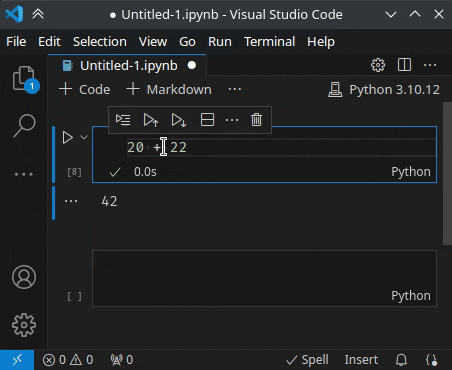

# Notebook: Run Selection

**Notebook: Run Selection/Line** runs selected code (or the current line) in a notebook cell — like **Jupyter: Run Selection/Line in Interactive Window**, but for notebooks. Useful when running an entire cell is too coarse and you just want to execute a sub-expression or a few lines.

## Usage

1. Open a Jupyter notebook (`.ipynb`).
2. Click into a code cell and select the code you want to run.
3. Press **Shift+Enter**. You need to grant kernel access once.

The selected code is executed in the *existing* kernel. The output replaces the current output of the active cell.

If nothing is selected and you execute the command using the command palette, the current line is used, but the keybinding **Shift+Enter** is only active with a selection.

## Configuration

| Setting                                       | Type    | Default | Description                                                                                           |
| --------------------------------------------- | ------- | ------- | ----------------------------------------------------------------------------------------------------- |
| `nbRunSelection.showExceptionsAsNotification` | boolean | `false` | Show kernel exceptions as a notification popup. Set to `false` to render them as cell output instead. |

## License

[MIT](LICENSE)

## Original Issue

This extension serves as a workaround for issue [microsoft/vscode#200625](https://github.com/microsoft/vscode/issues/200625). There is one difference: This extension cannot start a kernel, currently.
